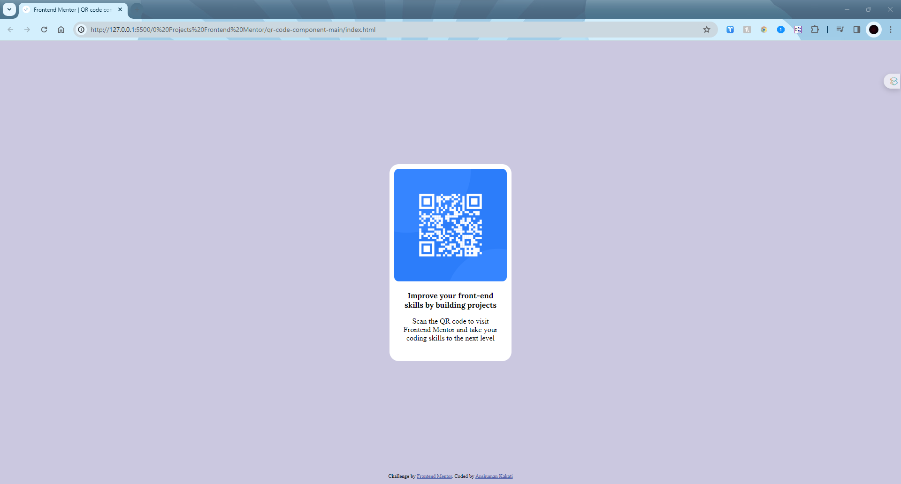

# Frontend Mentor - QR code component solution

This is a solution to the [QR code component challenge on Frontend Mentor](https://www.frontendmentor.io/challenges/qr-code-component-iux_sIO_H). Frontend Mentor challenges help you improve your coding skills by building realistic projects. 

## Table of contents

- [Overview](#overview)
  - [Screenshot](#screenshot)
  - [Links](#links)
- [My process](#my-process)
  - [Built with](#built-with)
  - [What I learned](#what-i-learned)

## Overview

### Screenshot

Screenshot of my solution.

### Links

- Solution URL: [Repositry link](https://github.com/anshumanbot1/qr-code-solution)
- Live Site URL: [Live QR code solution site](https://anshumanbot1.github.io/qr-code-solution/)

## My process

### Built with

- Semantic HTML5 markup
- CSS custom properties

### What I learned

Done daily practicing.
